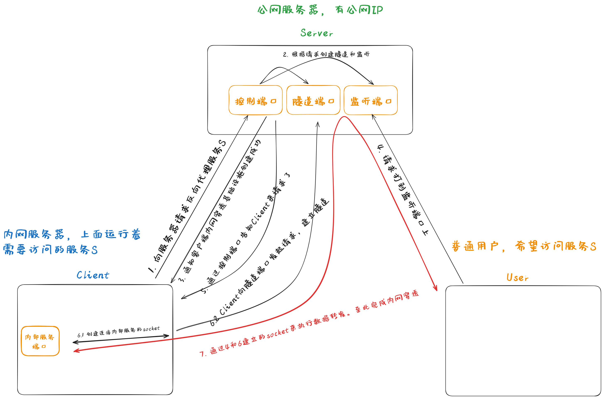
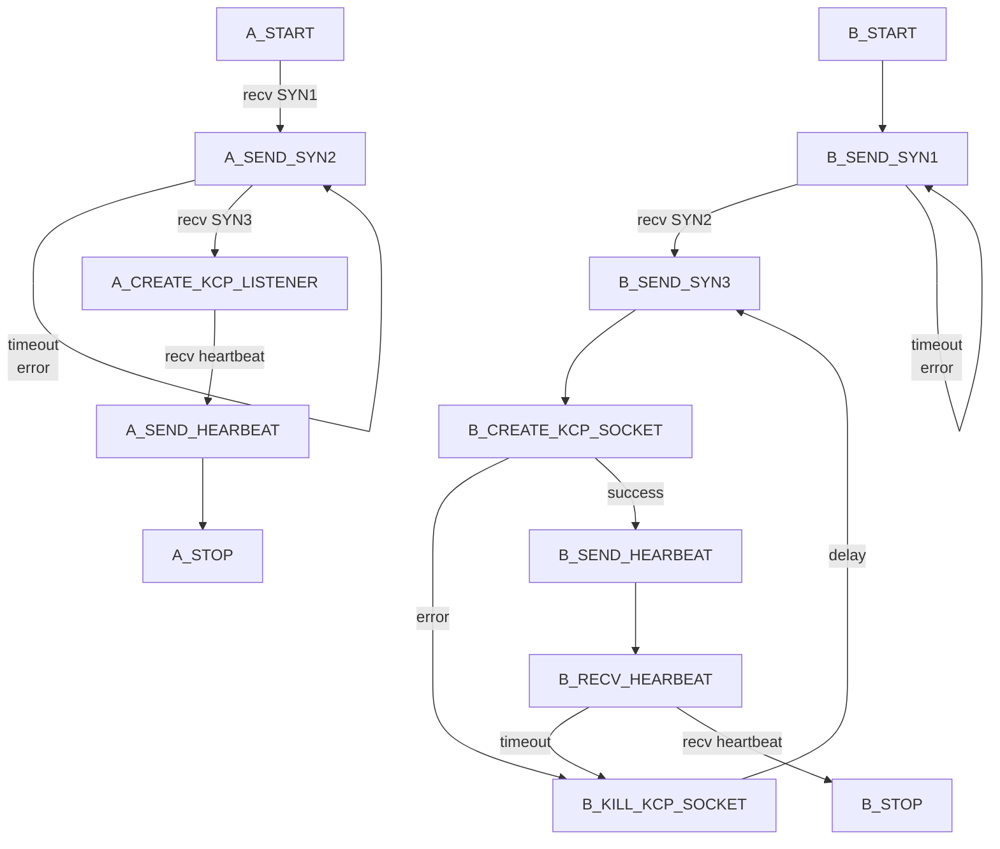
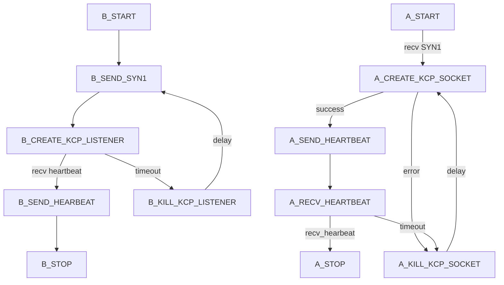
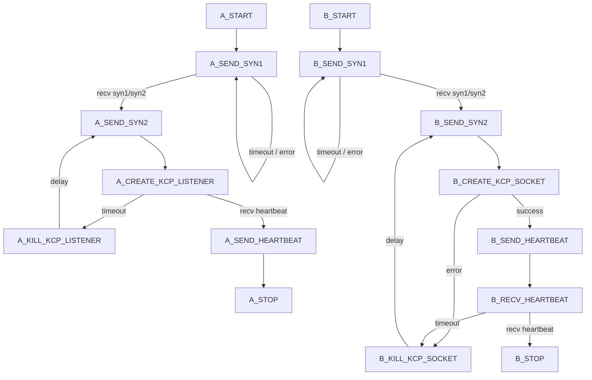
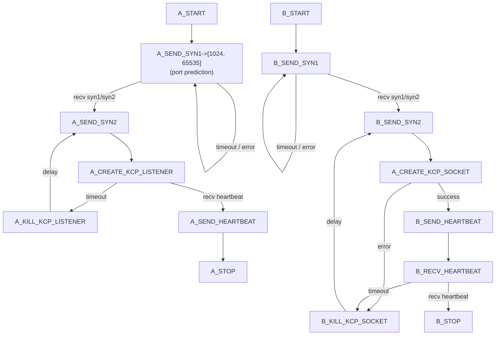
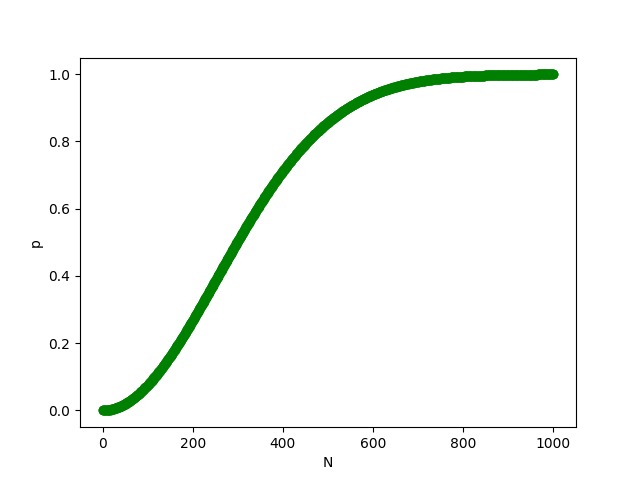

## pTunnel

### 背景

学校的服务器非常封闭，甚至连 SSH 端口都无法直接连接，每次都需要挂 VPN 才能访问实验室的服务器。为了方便访问实验室的服务器，最初使用的是[frp](https://github.com/fatedier/frp)进行内网穿透。但是好景不长，学校服务器的防火墙识别出了frp的请求，然后将其拦截了。为了继续进行内网穿透，我决定自己手撸一个内网穿透工具。

### 简介

pTunnel 是一个内网穿透工具，通过 pTunnel 可以将内网的 TCP 服务映射到公网上，从而可以通过公网访问内网的服务。该项目参考自[frp v0.5.0](https://github.com/fatedier/frp/tree/v0.5.0)。加密通信的机制参考自https加密过程。首先客户端生成一个AES密钥, 然后将AES密钥通过服务器的公钥加密，发送给服务器。服务器使用RSA私钥解密，得到AES密钥，后续通信则会使用该AES密钥加密通信数据。与https不同的是，公钥直接保存在了服务器，而不是通过CA机构来签发。第二点，pTunnel在建立内网穿透的隧道时，支持多种隧道类型，包括TCP隧道、KCP隧道、SSH隧道。每种隧道都支持数据通过生成的AES密钥进行加密（当然也可以不加密）。
New：目前已经为该工具添加了P2P的支持，其核心技术是使用UDP打洞技术来穿越NAT和防火墙

### 快速开始
1. 获取`pTunnelClient`，`pTunnelServer`，`pTunnelGenRSAKey`，`pTunnelProxy`
	1. 法一: 从源码编译
		1. 服务器端
            ```shell
            git clone https://github.com/pangxincheng/pTunnel.git
            cd pTunnel
            DIR=$(pwd)
            VERSION=$(git -C "$DIR" describe --tags)
            go mod tidy
            
            go build -ldflags "-X pTunnel/utils/version.version=$VERSION" \
            -o pTunnelServer cmd/server/pTunnelServer.go
            
            go build -ldflags "-X pTunnel/utils/version.version=$VERSION" \
            -o pTunnelGenRSAKey cmd/genRSAKey/pTunnelGenRSAKey.go
            ```
		2. 客户端(指的是内网的服务器)
            ```shell
            git clone https://github.com/pangxincheng/pTunnel.git
            cd pTunnel
            DIR=$(pwd)
            VERSION=$(git -C "$DIR" describe --tags)
            go mod tidy

            go build -ldflags "-X pTunnel/utils/version.version=$VERSION" \
            -o pTunnelClient cmd/server/pTunnelClient.go
            ```
		3. 代理端(如果需要使用P2P模式进行内网穿透的话)
            ```shell
            git clone https://github.com/pangxincheng/pTunnel.git
            cd pTunnel
            DIR=$(pwd)
            VERSION=$(git -C "$DIR" describe --tags)
            go mod tidy

            go build -ldflags "-X pTunnel/utils/version.version=$VERSION" \
            -o pTunnelProxy cmd/server/pTunnelProxy.go
            ```
    2. 法二: 从release下载(在ubuntu-latest上进行编译得到，可以缺少库文件)
2. 在服务器上生成RSA公钥和密钥
```shell
./pTunnelGenRSAKey
```
3. 将生成的`cert/PublicKey.pem`和`cert/NBits.txt`文件拷贝到客户端/代理端(如果有的话)目录下
4. 在服务器上配置`conf/server.ini`, 并且修改配置
    ```shell
    cp conf/server.ini.example conf/server.ini
    vim conf/server.ini
    ```
5. 在客户端上配置`conf/client.ini`, 并且修改配置
    ```shell
    cp conf/client.ini.example conf/client.ini
    vim conf/client.ini
    ```
6. 在代理端上配置`conf/proxy.ini`, 并且修改配置
    ```shell
    cp conf/proxy.ini.example conf/proxy.ini
    vim conf/proxy.ini
    ```
7. 此时你的项目目录应该至少包含以下文件
    ```shell
        # 服务器端
        .
        ├── cert
        │   ├── NBits.txt
        │   └── PublicKey.pem
        |   └── PrivateKey.pem
        ├── conf
        │   └── server.ini
        ├── pTunnelServer
        └── pTunnelGenRSAKey
    
        # 客户端
        .
        ├── cert
        │   ├── NBits.txt
        │   └── PublicKey.pem
        ├── conf
        │   └── client.ini
        └── pTunnelClient

        # 代理端
        .
        ├── cert
        │   ├── NBits.txt
        │   └── PublicKey.pem
        ├── conf
        │   └── proxy.ini
        └── pTunnelProxy
    ```
8. 在服务器端执行下面的命令
    ```shell
    ./pTunnelServer
    ```
9. 在客户端执行下面的命令
    ```shell
    ./pTunnelClient
    ```
10. 在代理端执行下面的命令
    ```shell
    ./pTunnelProxy
    ```
### TODO
1. ~~支持数据加密隧道~~
2. ~~支持SSH隧道~~
3. ~~README.md的完善~~
4. ~~更复杂的隧道验证机制~~
5. ~~支持P2P的内网穿透~~
6. 对P2P的代码进行优化
7. 为代理端添加GUI
8. 服务内部的状态监控GUI

### 设计细节

#### 服务器中转
基于服务器中转的设计方案如下:

<div style="text-align:center;">
  
  <p style="font-size: smaller; color: grey;">图1: 基于服务器中转的方案</p>
</div>
这个方案里面有几点要注意:  

1. 由于控制端口, 隧道端口和监听端口是解耦的, 因此可以使用不同的协议(tcp4/tcp6/kcp4/kcp6/ssh4/ssh6)来实现, 在我们的实现中控制端口可以选择使用tcp4/tcp6/kcp4/kcp6来创建listener, 隧道端口可以选择使用tcp4/tcp6/kcp4/kcp6/ssh4/ssh6来创建listener, 监听端口可以选择使用tcp4/tcp6/kcp4/kcp6来创建不同的listener, 但建议还是和内部服务的协议保持一致
2. 需要加密的数据包括: 从Client到控制端口之间的控制信息(RSA+AES加密), 从Client到隧道端口之间的隧道(AES加密/不加密), 其他的数据传输过程由于需要和外界交互, 加密过程需要由具体的应用来实现, 如果服务自身不加密, pTunnel无法保证数据传输过程的全程加密, 但如果服务自身加密, 此时从Client到隧道端口之间的隧道其实可以不加密, 所以隧道是否加密用户可自行配置(因为我自己只有把ssh端口暴露出去的需求, 所以我平时隧道是不加密的)

图1的方案是整个项目的基础, 即使在后面的P2P实现中, 也是在此基础上改进而来的

#### P2P
图1的方案有个致命缺陷, 就是它的数据需要服务器中转, 如果服务器带宽比较小, 很容易成为瓶颈, 尤其对我这种只能买起带宽只有1m的学生机的人而言, 服务器中转真的苦不堪言(不过U1S1, 学生机真的挺实用的, 经常折腾学生机才让自己对Linux用起来得心应手)。

我们的需求是摆脱中转服务器实现User和Client之间的直接通信, 这实际上就是P2P技术。

在早期的QQ通信中就使用了P2P技术, 曾经的BT种子站, 现在高校的PT站都是基于P2P技术来进行通信数据传输, 这个项目中的P2P技术就大量借鉴了这些知识(做到后面才发现原来frp新版本里面也实现了P2P的内网穿透, 早知道就直接去看新版的frp的源码了🤣)

P2P技术的难点在于NAT路由器, NAT路由器的最初目的用于缓解ipv4地址不够用的问题, 但是NAT路由器对P2P技术造成了很严重的阻碍, 如果没有NAT路由器, P2P的通信是非常简单的事情.
##### 理论准备
NAT路由器的基本功能是将内网的一个套接字IP:port映射到外网的一个套接字IP:port:

$$
\begin{equation}
{\rm ip_{e}}, {\rm port_{e}} = {\rm NAT}\left({\rm ip_{i}}, {\rm port_{i}}\right)
\end{equation}
$$

另外, NAT路由器还可以过滤外部的请求, 用于对位于NAT路由器后面的设备进行保护.

按照[RFC5389](https://datatracker.ietf.org/doc/html/rfc5389)的定义, NAT路由器的类别可以由其映射规则(MappingBehavior)和过滤规则(FilterBehavior)定义(还有另外一种定义: 全锥型, 端口限制型, 地址端口限制型, 对称型, 这个定义是在早期的[RFC3489](https://datatracker.ietf.org/doc/html/rfc3489)中给出的定义, 但是其定义并不完全, 所以[RFC3489](https://datatracker.ietf.org/doc/html/rfc3489)已经完全被[RFC5389](https://datatracker.ietf.org/doc/html/rfc5389)取代了, [RFC5389](https://datatracker.ietf.org/doc/html/rfc5389)中定义的NAT路由器类别可以完全覆盖到[RFC3489](https://datatracker.ietf.org/doc/html/rfc3489)中定义的四种类型)

1. 映射规则(Mapping Behavior)

    1. Endpoint-Independent Mapping
    NAT映射函数：

$$
\begin{equation}
{\rm ip_{nat}}, {\rm port_{nat}} = {\rm NAT}\left({\rm ip_{src}}, {\rm port_{src}}\right)
\end{equation}
$$

    即NAT映射后的IP只和发送方IP以及Port相关  

    2. Address-Dependent Mapping
    NAT映射函数：

$$
\begin{equation}
{\rm ip_{nat}}, {\rm port_{nat}} = {\rm NAT}\left({\rm ip_{src}}, {\rm port_{src}}, {\rm ip_{tgt}}\right)
\end{equation}
$$

    即NAT映射除了和发送方的IP以及Port相关外，还和接收方的IP相关

    3. Address-and-Port-Dependent Mapping
    NAT映射函数：

$$
\begin{equation}
{\rm ip_{nat}}, {\rm port_{nat}} = {\rm NAT}\left({\rm ip_{src}}, {\rm port_{src}}, {\rm ip_{tgt}}, {\rm port_{tgt}}\right)
\end{equation}
$$

    即NAT映射跟发送方的IP以及Port，接收方的IP以及Port相关

2. 过滤规则(Filtering Behavior)

    为了方便描述，我们统一定义位于内网的IP地址为192.168.1.a，经过NAT之后的IP为
    184.167.234.191，要访问的外网IP为：1.1.1.1:yyyy

    1. Endpoint-Indenpendent Filtering  
        过滤规则：对于发往184.167.234.191:xxxx的数据，NAT路由器检查  
        1. 是否有内网的socket和184.167.234.191:xxxx进行了绑定  
        如果有，则直接将数据转发到该socket上  
    2. Address-Dependent Filtering   
        过滤规则：对于发往184.167.234.191:xxxx的数据，NAT路由器检查  
        1. 是否有内网的socket和184.167.234.191:xxxx进行了绑定  
        2. 是否184.167.234.191:xxxx和1.1.1.1进行过通信  
        如果有，则直接将数据转发到该socket上  
    3. Address-and-Port-Dependent Filtering  
        过滤规则：对于发往184.167.234.191:xxxx的数据，NAT路由器检查  
        1. 是否有内网的socket和184.167.234.191:xxxx进行了绑定  
        2. 是否184.167.234.191:xxxx和1.1.1.1:yyyy进行过通信  
        如果有，则直接将数据转发到该socket上  

在[RFC5389](https://datatracker.ietf.org/doc/html/rfc5389)的定义下，可以重新得到[RFC3489](https://datatracker.ietf.org/doc/html/rfc3489)下定义的NAT
1. Full Cone NAT(完全圆锥NAT) = Endpoint-Independent Mapping + Endpoint-Independent Filtering
2. Address Restricted Cone NAT(地址限制式圆锥NAT) = Endpoint-Independent Mapping + Address-Dependent Filtering
3. Port Restricted Cone NAT(端口限制式圆锥NAT) = Endpoint-Independent Mapping + Address-and-Port Dependent Filtering
4. Symmetric NAT(对称式NAT) = Address-and-Port Dependent Mapping + Address-and-Port Dependent Filtering

由此可见，RFC5389对NAT有着更为清晰的定义，在RFC5389的基础上，可以使用stun协议来检验当前的设备位于什么类型的NAT后

##### 实践
为了应对NAT路由器, P2P必须穿越NAT路由器, 它采用的技术叫UDP打洞(UDP Hole Punching).
UDP打洞的核心思想是**欺骗NAT路由器**以为它收到了对方的回复(殊不知是对方主动发出的包), 针对不同的NAT路由器有着不同的实现, 关于具体的实现理论, 可以参考[P2P技术详解(二)：P2P中的NAT穿越(打洞)方案详解](http://www.52im.net/thread-542-1-1.html), 写得非常好.

UDP打洞的过程实际上类似于TCP握手的过程, TCP三次握手是为了确认两件事, UDP打洞过程中同样需要确认两件事(为了方便描述我们称通信两端分别叫clientA和clientB, 它们分别位于natA和natB后面):
1. 确认natA和natB已经完成了打洞
2. 确认对方也知道了1

针对不同的nat设备, 我使用了不同的状态机建模UDP打洞过程, 下面是我的建模(不一定对)
###### UDP打洞的状态机
定义：
> EIM     = Endpoint-Independent Mapping  
> ADM     = Address-Dependent Mapping  
> APDM    = Address-and-Port-Dependent Mapping  
> EIF     = Endpoint-Independent Filtering  
> ADF     = Address-Dependent Filtering  
> APDF    = Address-and-Port-Dependent Filtering  

| A行B列      | EIM+EIF   | EIM+ADF   | EIM+APDF  | ADM+EIF     | ADM+ADF     | ADM+APDF    | APDM+EIF    | APDM+ADF    | APDM+APDF   |
| --------- | --------- | --------- | --------- | ----------- | ----------- | ----------- | ----------- | ----------- | ----------- |
| EIM+EIF   | `Fn1(A, B)` | `Fn1(A, B)` | `Fn1(A, B)` | `Fn1(A, B)`   | `Fn1(A, B)`   | `Fn1(A, B)`   | `Fn1(A, B)`   | `Fn1(A, B)`   | `Fn1(A, B)`   |
| EIM+ADF   | `Fn1(B, A)` | `Fn2(A, B)` | `Fn2(A, B)` | `Fn3(A, B)`   | `Fn3(A, B)`   | `Fn3(A, B)`   | `Fn3(A, B)`   | `Fn3(A, B)`   | `Fn3(A, B)`   |
| EIM+APDF  | `Fn1(B, A)` | `Fn2(A, B)` | `Fn2(A, B)` | `Fn3(A, B)`   | `Fn3(A, B)`   | `Fn3(A, B)`   | `Fn3(A, B)`   | `Fn3(A, B)`   | `Fn3(A, B)`   |
| ADM+EIF   | `Fn1(B, A)` | `Fn3(B, A)` | `Fn3(B, A)` | No Solution | No Solution | No Solution | No Solution | No Solution | No Solution |
| ADM+ADF   | `Fn1(B, A)` | `Fn3(B, A)` | `Fn3(B, A)` | No Solution | No Solution | No Solution | No Solution | No Solution | No Solution |
| ADM+APDF  | `Fn1(B, A)` | `Fn3(B, A)` | `Fn3(B, A)` | No Solution | No Solution | No Solution | No Solution | No Solution | No Solution |
| APDM+EIF  | `Fn1(B, A)` | `Fn3(B, A)` | `Fn3(B, A)` | No Solution | No Solution | No Solution | No Solution | No Solution | No Solution |
| APDM+ADF  | `Fn1(B, A)` | `Fn3(B, A)` | `Fn3(B, A)` | No Solution | No Solution | No Solution | No Solution | No Solution | No Solution |
| APDM+APDF | `Fn1(B, A)` | `Fn3(B, A)` | `Fn3(B, A)` | No Solution | No Solution | No Solution | No Solution | No Solution | No Solution |

- `Fn1(clientA, clientB)`的状态机
clientA端口固定, 会放通所有的请求
clientB没有要求

[极简版]状态机(理论上也可以工作)



- `Fn2(clientA, clientB)`的状态机
clientA的IP和端口固定，但是会对访问的IP(和端口)进行限制
clientB的IP和端口固定，但是会对访问的IP(和端口)进行限制


- `Fn3(clientA, clientB)`的状态机
- clientA的IP和端口固定，但是会对访问的IP(和端口)进行限制
- clientB的IP和端口不固定，但是会直接放通所有的请求/对访问的IP(和端口)进行限制

其中有几点要注意, 我们在clientA的`Fn3(clientA, clientB)`的状态机中使用了端口预测, 这个技术的理论基础是生日悖论, 设目标端口x是服从均匀分布的, 问不放回的均匀采样N次选中X的概率是多少?

可以算一下, 第i次没有选中的概率为:

$$
\begin{equation}
\frac{65535-1024-i}{65535-1024}
\end{equation}
$$

那么选N次选中x的概率为:

$$
\begin{equation}
p = 1 - \prod \limits_{i=1}^{N}\frac{65535-1024-i}{65535-1024}
\end{equation}
$$

N-p的曲线如下图所示

<div style="text-align:center;">
  
  <p style="font-size: smaller; color: grey;">图2: N-p</p>
</div>

非常神奇, 只需要随机差不多1000次, 你就会以接近1的概率猜到x

但这个其实仅限于理论推导, 因为实际情况中x不是均匀分布, 而且网络中有防火墙, 你不能发的太快, 否则对方的防火墙直接就把你给短暂封禁了
##### 基于ipv6的P2P
当我用代码实现了上述的状态机开始测试时才发现, UDP打洞困难重重, 在我几乎接近放弃的时候, 我打开了[byt.pt](https://byr.pt)看我最近的做种情况, 我突然想起自己目前所处的网络是教育网, 教育网内部的ipv6在高校之间是互通的, 于是咱又有想法了, 我直接使用ipv6来实现p2p不就好了。于是就有了基于ipv6的P2P内网穿透。

在这种情况下我们假设client和user都是有公网的ipv6地址的, 如果我们把防火墙看作NAT的话(俺的学校就禁止外网设备主动访问位于学校内部的主机), 那么此时通信的双方实际上可以看作是EIM+APDF形的NAT, 那么好了, 我直接套前面的Fn2状态机于是轻松实现了P2P的内网穿透